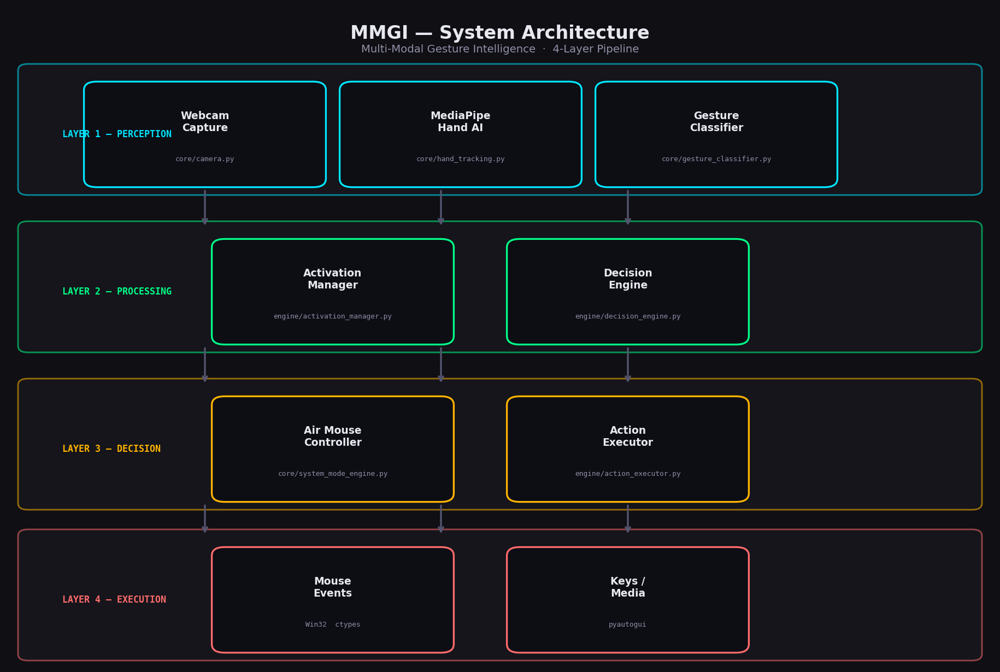

# MMGI — Multi-Modal Gesture Intelligence

> **Touch-free computer control through real-time AI hand gesture recognition.**

[](https://python.org)
[](https://pypi.org/project/PyQt6/)
[](https://mediapipe.dev)
[](#license)

---

## 1 · Overview

**MMGI (Multi-Modal Gesture Intelligence)** is a real-time hand gesture recognition system
that turns an ordinary webcam into a touch-free input device. Powered by Google's
**MediaPipe HandLandmarker** AI model, it tracks 21 hand landmarks per frame, classifies
finger configurations into named gestures, and maps those gestures to live system actions —
all without any cloud connection, custom hardware, or driver installation.

### Why it matters
Modern HCI is still dominated by keyboards and mice. MMGI explores the next interaction
paradigm: **intent-driven gesture commands**. It shows that a $0 webcam + a Python runtime
can control an entire OS — from launching apps to scrolling and clicking — with a latency
budget under 50 ms.

### Key innovation — Smart Mode Switching
A single hand pose (Three Fingers held for 1 second) cycles through three **context modes**
(App / Media / System). Each mode maps identical gestures to *different* actions, multiplying
the command vocabulary without requiring the user to learn new poses. The System Mode engages
a full **Air Mouse** controller — moving the cursor, clicking, scrolling, and double-clicking
entirely through finger choreography.

---

## 2 · Features

### Hand Gesture Recognition
- Rule-based classifier operating on the 5-finger state vector produced by MediaPipe
- Recognises 10 named gestures: One Finger, Two Fingers, Three Fingers, Four Fingers,
  Open Palm, Fist, Thumbs Up, Pinky, Ring and Pinky, Unknown
- Zero ML training required — deterministic and fully inspectable logic
- Runs at the native camera frame rate (~30 FPS)

### Motion Tracking
- MediaPipe **HandLandmarker** (Tasks API, VIDEO mode) — 21 3-D landmarks per hand
- Landmark index 8 (index fingertip) drives the Air Mouse cursor
- Exponential Moving Average (EMA) smoothing (`α = 0.25`) removes jitter
- Dead-zone filter (4 px default) prevents cursor drift when the hand is still
- 12 % edge margin on the camera frame maps cleanly to the full screen rectangle

### Smart Mode Switching
- Three context modes — **App Mode**, **Media Mode**, **System Mode**
- Switch trigger: Three Fingers held for **1 second** (10-frame stability gate + 1.5 s cooldown)
- Visual feedback: live stability progress bar in the dashboard during the hold
- Activation safety gate: **Open Palm held 2 s** to go ACTIVE; **Fist** to deactivate instantly
- Mode + activation state broadcast via `SharedState` PyQt6 signals to every UI panel in real time

### Air Mouse (System Mode)
| Gesture | Mouse Action |
|---|---|
| ☝️ One Finger | Move cursor (EMA-smoothed) |
| ✌️ Two Fingers | Scroll (vertical delta from anchor) |
| 🤙 Pinky | Left click |
| 🤘 Ring and Pinky | Right click |
| 👍 Thumbs Up | Double-click |

All clicks use **rising-edge detection** (fire once per gesture onset, not on hold) with a
0.5 s cooldown between consecutive clicks. Win32 `ctypes` — no external mouse library needed.

### Fully Offline Processing
- MediaPipe model file ships locally (`hand_landmarker.task`) — no network call per frame
- No cloud API, no telemetry, no subscription — runs entirely on the local CPU
- `--headless` flag lets the pipeline run without the Qt dashboard (pure OpenCV window)

---

## 3 · Architecture



### Pipeline Diagram

```
┌──────────────────────────────────────────────────────────────────────────┐
│                         WorkerThread  (QThread)                          │
│                                                                          │
│  ┌──────────┐    ┌─────────────────┐    ┌──────────────────────────┐    │
│  │  Camera  │───▶│  HandTracker    │───▶│   GestureClassifier      │    │
│  │  (cv2)   │    │  (MediaPipe AI) │    │   (rule-based, 10 poses) │    │
│  └──────────┘    └─────────────────┘    └──────────────────────────┘    │
│       │                  │                          │                    │
│  raw frame          21 landmarks              gesture name               │
│                     finger states                   │                    │
│                                                     ▼                    │
│                                         ┌───────────────────────┐       │
│                                         │   DecisionEngine      │       │
│                                         │  · mode management    │       │
│                                         │  · action lookup      │       │
│                                         │  · stability tracking │       │
│                                         └───────────────────────┘       │
│                                                     │                    │
│                                          action string / mode event      │
│                                                     │                    │
│                            ┌────────────────────────┤                   │
│                            ▼                        ▼                   │
│                  ┌──────────────────┐    ┌──────────────────────┐       │
│                  │ ActivationManager│    │  SystemModeEngine    │       │
│                  │ (safety gate)    │    │  AirMouseController  │       │
│                  └──────────────────┘    └──────────────────────┘       │
│                            │                        │                   │
│                            ▼                        ▼                   │
│                     ActionExecutor          Win32 mouse_event /          │
│                     (pyautogui)             SetCursorPos                 │
│                                                                          │
│  SharedState.set_*() ──────────────────────────────────────▶ UI panels  │
│  frame_ready.emit(QImage) ──────────────────────────────▶ VisionPanel   │
└──────────────────────────────────────────────────────────────────────────┘
```

### Component responsibilities

| Layer | Module | Responsibility |
|---|---|---|
| **Input** | `core/camera.py` | OpenCV `VideoCapture`, raw BGR frame |
| **Perception** | `core/hand_tracking.py` | MediaPipe HandLandmarker, 21-landmark struct |
| **Classification** | `core/gesture_classifier.py` | Finger-state vector → gesture name string |
| **Decision** | `engine/decision_engine.py` | Mode management, gesture→action lookup, stability gate |
| **Safety** | `engine/activation_manager.py` | Open Palm hold-to-activate, Fist-to-deactivate |
| **Execution** | `engine/action_executor.py` | `pyautogui` keyboard / media key dispatch |
| **Air Mouse** | `core/system_mode_engine.py` | EMA cursor tracking, Win32 click/scroll, rising-edge detection |
| **State bus** | `ui/shared_state.py` | `QObject` reactive store; typed `pyqtSignal` per field |
| **Pipeline** | `ui/worker_thread.py` | Background `QThread` owning the full per-frame loop |
| **Dashboard** | `ui/ui.py` | PyQt6 `QMainWindow` + all panels + QSS stylesheet |

---

## 4 · Installation

### Prerequisites
- Python **3.10 or later**
- A working webcam (any USB or built-in camera recognised by OpenCV)
- Windows 10 / 11 (Air Mouse uses Win32 calls; other features are cross-platform)

### Steps

```bash
# 1. Clone the repository
git clone https://github.com/your-username/MMGI.git
cd MMGI

# 2. Create and activate a virtual environment (recommended)
python -m venv venv
venv\Scripts\activate          # Windows
# source venv/bin/activate     # macOS / Linux

# 3. Install all dependencies
pip install -r requirements.txt

# 4. Place the MediaPipe model file in the project root
#    Download from:
#    https://storage.googleapis.com/mediapipe-models/hand_landmarker/hand_landmarker/float16/1/hand_landmarker.task
#    The file must be named exactly:  hand_landmarker.task

# 5. Launch the dashboard
python main.py

# Optional — run without the Qt UI (OpenCV window only)
python main.py --headless
```

### Activation protocol (first run)

| Step | What to do | Result |
|---|---|---|
| 1 | Show **Open Palm** to the camera and hold for **2 seconds** | Border turns green — system ACTIVE |
| 2 | Make a **Fist** | Instant deactivation |
| 3 | Hold **Three Fingers** for **1 second** | Cycles to next mode (App → Media → System → App) |
| 4 | Use mode gestures (see tables above) | Action fires; pill appears in Activity Log |

---

## 5 · Folder Structure

```
MMGI/
│
├── main.py                        # Entry point: --headless or Qt dashboard
├── requirements.txt               # All pip dependencies with minimum versions
├── hand_landmarker.task           # MediaPipe model file (not tracked in git)
│
├── config/
│   └── gesture_map.json           # Mode→gesture→action JSON config
│                                  # Edit this file to remap any gesture
│
├── core/                          # Pure perception — no UI, no Qt
│   ├── camera.py                  # Wraps cv2.VideoCapture; delivers BGR frames
│   ├── hand_tracking.py           # MediaPipe HandLandmarker Tasks API wrapper
│   ├── gesture_classifier.py      # Finger-state vector → gesture name (rule-based)
│   └── system_mode_engine.py      # AirMouseController + SystemModeEngine coordinator
│
├── engine/                        # Decision + execution layer
│   ├── activation_manager.py      # Safety gate: Open Palm hold = ACTIVE
│   ├── decision_engine.py         # Smart Mode state machine + action resolver
│   └── action_executor.py         # pyautogui dispatch: keys, apps, media commands
│
├── ui/                            # All PyQt6 code
│   ├── shared_state.py            # Reactive store — QObject + pyqtSignal per field
│   ├── worker_thread.py           # QThread owning the full pipeline loop
│   └── ui.py                      # Consolidated UI: MainWindow, Sidebar, VisionPanel,
│                                  # SystemPanel, ActivityLog, stylesheet tokens
│
├── utils/
│   ├── config.py                  # Dot-key JSON/YAML config loader helper
│   └── fps_counter.py             # Rolling-window FPS counter
│
├── tests/
│   ├── test_gesture_classifier.py # 14 unit tests for GestureClassifier
│   └── test_mode_switching.py     # 22 tests: DecisionEngine + AirMouseController
│
└── assets/                        # Static assets (screenshots, diagrams)
    └── ...
```

### What lives where and why

**`core/`** — perception only. No Qt, no pyautogui. Every class here can run in a
plain Python script with no UI dependency. Unit-testable in isolation.

**`engine/`** — decision and execution. Takes a gesture name string, returns an action
string or fires a system call. Contains all business logic for mode management and safety
gating. No camera or MediaPipe imports.

**`ui/`** — everything PyQt6. `shared_state.py` is the single reactive data bus;
`worker_thread.py` is the bridge between the pipeline and the UI; `ui.py` is the
entire dashboard in one consolidated module.

**`config/gesture_map.json`** — the only file a non-developer needs to touch to
remap gestures. Each mode section is a flat `"GestureName": "action_key"` dict.

---

## 6 · Screenshots

> **Add screenshots to `assets/` and update the paths below.**

### Dashboard — App Mode (Inactive)

```
┌────────────────────────────────────────────────────────────────────────┐
│  ◉ MMGI    Smart Mode AI Controller              APP MODE  ⬤ INACTIVE  │
├──────────┬──────────────────────────────────────┬───────────────────── │
│          │                                      │  SYSTEM              │
│ [Vision] │         Live Camera Feed             │  ● OFF  [Activate]   │
│ [Mode]   │     (MediaPipe hand skeleton         │                      │
│          │      overlay + gesture label)        │  MODE                │
│ ◄ Collapse│                                     │  ◈ App Mode          │
│          │  ████████░░░░░░░░  Stability Bar     │  One Finger → Browser│
│          │                                      │  Two Fingers → Music │
│          │                                      │                      │
│          │                                      │  PERFORMANCE         │
│          │                                      │  FPS  ▓▓▓▓▓  28.4   │
│          │                                      │  Latency      18 ms  │
├──────────┴──────────────────────────────────────┴──────────────────────│
│  ● [12:04:11]  SYSTEM  Initialised  ·  ● [12:04:15]  MODE  App Mode    │
└────────────────────────────────────────────────────────────────────────┘
```

> Place actual screenshots at `assets/screenshot_app_mode.png` and
> `assets/screenshot_system_mode.png`.

---

## 7 · Future Scope

### Face Expression Enhancement
Extend the perception layer with MediaPipe **FaceLandmarker** to detect brow raises,
eye winks, or mouth gestures as supplementary command triggers — enabling completely
hands-free interaction for accessibility use cases.

### Performance Optimisation
- Replace the per-frame blocking `HandLandmarker.detect_for_video()` call with an
  async double-buffer strategy to decouple capture FPS from inference FPS
- Profile and accelerate the EMA smoothing and coordinate-mapping hot paths with NumPy
  vectorised operations
- Investigate running MediaPipe on a dedicated thread pool to utilise multi-core CPUs
  more fully and push toward a stable 60 FPS pipeline

### Adaptive Gesture Thresholds
Replace the current hard-coded finger-state thresholds in `GestureClassifier` with a
lightweight **online calibration** pass at startup: the user performs each named gesture
once, and the classifier learns per-user landmark distance distributions rather than
fixed global rules. This would significantly improve accuracy across hand sizes and
lighting conditions without requiring a training dataset.

### Additional Scope Items
- **Multi-hand support** — two-hand chord gestures for richer command vocabularies
- **Plugin action system** — allow `gesture_map.json` to reference user-defined Python
  callables rather than hard-coded pyautogui strings
- **Cross-platform Air Mouse** — replace Win32 `ctypes` calls with a platform-abstracted
  mouse backend (`pynput`) for macOS and Linux support
- **Gesture recording & playback** — record landmark sequences and replay as macro scripts
- **WebSocket bridge** — emit gesture events over a local WebSocket so browser-based apps
  can subscribe without any Python integration

---

## 🎮 Gesture Reference

### App Mode
| Gesture | Action |
|---|---|
| 👍 Thumbs Up | Open Browser (Brave) |
| 🤘 Ring and Pinky | Open Music (Apple Music) |
| 🤙 Pinky | Volume Up |

### Media Mode
| Gesture | Action |
|---|---|
| 🤘 Ring and Pinky | Next Track |
| 🤙 Pinky | Previous Track |
| 🖐️ Open Palm | Play / Pause |
| 👍 Thumbs Up | Volume Up |

### System Mode — Air Mouse
| Gesture | Mouse Action |
|---|---|
| ☝️ One Finger | Move cursor |
| ✌️ Two Fingers | Scroll |
| 🤙 Pinky | Left click |
| 🤘 Ring and Pinky | Right click |
| 👍 Thumbs Up | Double-click |

> Hold **Three Fingers** for 1 s to cycle between modes.
> Show **Open Palm** for 2 s to activate. **Fist** to deactivate.

---

## ⚙️ Requirements

| Package | Version | Purpose |
|---|---|---|
| `numpy` | ≥ 2.3 | Array operations for MediaPipe landmark data |
| `opencv-python` | ≥ 4.10 | Webcam capture + frame annotation |
| `mediapipe` | ≥ 0.10.30 | Hand landmark AI inference |
| `pyautogui` | ≥ 0.9.54 | Keyboard / media key automation |
| `PyQt6` | ≥ 6.7 | Dashboard UI framework |

---

## ⚖️ License

This project is for educational purposes.
