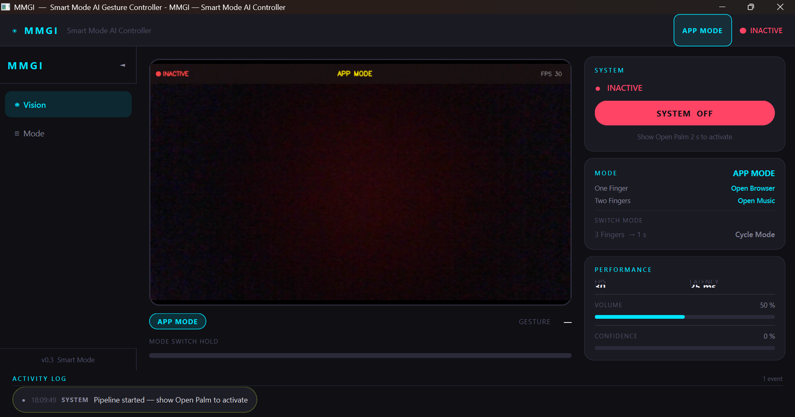

# MMGI — Multi-Modal Gesture Intelligence

<p align="center">
  <strong>Touch-free desktop control through real-time hand gesture recognition.</strong><br/>
  A rule-based, fully offline gesture control system built with Python and MediaPipe.
</p>

<p align="center">
  
  
  
  
  
  
</p>

---

## Table of Contents

1. [Overview](#1--overview)
2. [Screenshots](#2--screenshots)
3. [Features](#3--features)
4. [Architecture](#4--architecture)
5. [Project Structure](#5--project-structure)
6. [Technology Stack](#6--technology-stack)
7. [Installation](#7--installation)
8. [How to Run](#8--how-to-run)
9. [Gesture Reference](#9--gesture-reference)
10. [Testing](#10--testing)
11. [Performance Metrics](#11--performance-metrics)
12. [Privacy & Security](#12--privacy--security)
13. [Innovation Highlights](#13--innovation-highlights)
14. [Future Scope](#14--future-scope)
15. [Author](#15--author)
16. [License](#16--license)

---

## 1 · Overview

**MMGI (Multi-Modal Gesture Intelligence)** is a real-time, touch-free desktop control
system that uses an ordinary webcam as its only input device. It tracks 21 hand landmarks
per frame using Google's MediaPipe HandLandmarker model, classifies hand configurations
into named gestures via a deterministic rule-based classifier, and dispatches live system
actions — all running locally on the CPU with no network dependency.

The system operates across three contexts — **App Mode**, **Media Mode**, and **System Mode**
— each mapping the same gesture vocabulary to a different set of actions. A dedicated
**Smart Mode Switching** engine lets the user cycle between contexts with a single held
gesture, multiplying the command space without requiring additional gestures to be learned.

**MMGI is an academic mini-project** demonstrating applied human-computer interaction (HCI)
engineering: perception, classification, decision logic, action execution, and a reactive
PyQt6 dashboard are implemented as clearly separated, independently testable layers.

### Design Principles

- **No ML classifier** — gesture recognition is entirely deterministic, based on computed
  finger extension states derived from landmark geometry
- **Fully offline** — the MediaPipe model file ships with the project; no network call is
  made per frame or at runtime
- **Rule-based architecture** — all decision logic is explicit, readable, and auditable
- **Safety-gated activation** — the system requires a deliberate hold gesture before
  executing any actions, preventing accidental triggers

---

## 2 · Screenshots

### Dashboard — App Mode

<p align="center">
  
</p>

> Three-panel layout: left sidebar (Vision / Mode navigation), centre live camera feed
> with gesture label and stability bar overlay, right info panel (System status, Mode map,
> Performance metrics, Volume and Confidence indicators). Activity Log timeline at the bottom.

---

## 3 · Features

### 3.1 Hand Gesture Recognition

- **Rule-based classifier** operating on the 5-finger extension state vector derived from
  MediaPipe 21-landmark output — no training data or model weights required
- Recognises **10 named gestures**: One Finger, Two Fingers, Three Fingers, Four Fingers,
  Open Palm, Fist, Thumbs Up, Pinky, Ring and Pinky, Unknown
- **Static gestures** (Open Palm, Fist, Thumbs Up, individual fingers) recognised per frame
- **Dynamic gestures**: Swipe Left and Swipe Right detected by tracking horizontal landmark
  displacement across a configurable frame window
- **Stability gate**: a gesture must be consistently held for ≥ 10 consecutive frames before
  it is promoted to a confirmed command, preventing single-frame noise from triggering actions
- Fully deterministic — identical inputs always produce identical outputs; no probabilistic
  inference involved

### 3.2 Smart Mode System

The core architectural concept of MMGI. Rather than assigning a fixed action to each gesture,
the system groups gestures into three **context modes**. The active mode determines how each
gesture is interpreted.

| Mode | Switch Trigger | Context |
|---|---|---|
| App Mode | Three Fingers held 1 s | Application control |
| Media Mode | Three Fingers held 1 s | Media playback |
| System Mode | Three Fingers held 1 s | Air Mouse and cursor control |

- **Mode switch trigger**: Three Fingers held continuously for 1 second (10-frame stability
  gate + 1.5 s post-switch cooldown to prevent immediate re-trigger)
- **Visual feedback**: a stability progress bar in the dashboard fills during the hold and
  resets on release
- **Conflict prevention**: no mode switch is processed during the cooldown window

### 3.3 App Mode

| Gesture | Action |
|---|---|
| 👍 Thumbs Up | Open Browser |
| ✌️ Two Fingers | Open VS Code |
| 🤙 Pinky | Close active window (`Alt+F4`) |
| 🤘 Ring and Pinky | Task switch (`Alt+Tab`) |

### 3.4 Media Mode

| Gesture | Action |
|---|---|
| 🖐️ Open Palm | Play / Pause (`MediaPlayPause`) |
| ☝️ One Finger | Next Track (`MediaNextTrack`) |
| ✌️ Two Fingers | Previous Track (`MediaPrevTrack`) |
| 👍 Thumbs Up | Volume Up |
| 🤙 Pinky | Volume Down |

### 3.5 System Mode 

- Index fingertip (landmark 8) mapped to screen coordinates via a configurable edge-margin transform
- **EMA smoothing** (`α = 0.25`) applied to raw landmark coordinates to remove per-frame jitter
- **Dead-zone filter** (4 px default) suppresses cursor drift when the hand is stationary
- **Rising-edge detection** on all click gestures — fires once per onset, not on hold,
  with a 0.5 s inter-click cooldown
- Implemented via Win32 `ctypes` (`mouse_event`, `SetCursorPos`) — no external mouse library

### 3.6 Activation and Safety System

| Action | Trigger |
|---|---|
| Activate | Open Palm held for **2 seconds** |
| Deactivate | Fist (instant) |

- **Confidence threshold validation**: gestures below the MediaPipe detection confidence
  threshold are treated as Unknown and do not trigger any action
- **Activation hold timer**: the 2-second Open Palm hold prevents accidental activation
  when hands enter the camera frame incidentally
- System status broadcast in real time to all UI panels via `SharedState` PyQt6 signals

### 3.7 PyQt6 Dashboard

- Live camera feed panel with hand skeleton overlay and gesture label
- Mode indicator in header and right panel, colour-coded by active mode
- System status pill: ACTIVE / INACTIVE with contrasting colour cue
- Stability progress bar filling during Three-Finger mode-switch hold
- Rolling-window FPS counter and per-frame processing latency display
- Volume level and MediaPipe confidence percentage bars
- Timestamped activity log of gesture events and system state changes
- Collapsible sidebar with Vision and Mode navigation panels
- `--headless` flag to run the pipeline with a plain OpenCV window instead of Qt

---

## 4 · Architecture

### Pipeline

```
┌─────────────────────────────────────────────────────────────────────────┐
│                        WorkerThread (QThread)                           │
│                                                                         │
│  ┌───────────┐    ┌──────────────────┐    ┌──────────────────────────┐ │
│  │  Camera   │───▶│  HandTracker     │───▶│  GestureClassifier       │ │
│  │ (OpenCV)  │    │  (MediaPipe)     │    │  (rule-based)            │ │
│  └───────────┘    └──────────────────┘    └──────────────────────────┘ │
│   raw BGR frame    21 3-D landmarks         gesture name string         │
│                    finger states                     │                  │
│                                                      ▼                  │
│                                          ┌───────────────────────┐     │
│                                          │    DecisionEngine     │     │
│                                          │  · mode state machine │     │
│                                          │  · stability gate     │     │
│                                          │  · action lookup      │     │
│                                          └───────────────────────┘     │
│                                                      │                  │
│                              ┌───────────────────────┤                 │
│                              ▼                       ▼                 │
│                   ┌──────────────────┐   ┌───────────────────────┐    │
│                   │ActivationManager │   │  SystemModeEngine     │    │
│                   │ (safety gate)    │   │  AirMouseController   │    │
│                   └──────────────────┘   └───────────────────────┘    │
│                              │                       │                 │
│                              ▼                       ▼                 │
│                       ActionExecutor          Win32 ctypes             │
│                       (pyautogui)             mouse_event / SetCursorPos│
│                                                                         │
│  SharedState.set_*() ─────────────────────────────────▶ UI panels      │
│  frame_ready.emit(QImage) ────────────────────────▶ VisionPanel        │
└─────────────────────────────────────────────────────────────────────────┘
```

### Data Flow

```
Camera frame (BGR)
  └─▶ HandTracker           → NormalizedLandmarkList (21 points) + confidence
        └─▶ GestureClassifier → gesture name string  (e.g. "Three Fingers")
              └─▶ DecisionEngine → action key string  OR  mode switch event
                    ├─▶ ActivationManager  → ACTIVE / INACTIVE state
                    ├─▶ ActionExecutor     → pyautogui.hotkey(...)
                    ├─▶ SystemModeEngine   → cursor move / click / scroll
                    └─▶ SharedState        → pyqtSignals → UI panels (real-time)
```

### Layer Responsibilities

| Layer | Module | Responsibility |
|---|---|---|
| Input | `core/camera.py` | OpenCV `VideoCapture`, delivers raw BGR frames |
| Perception | `core/hand_tracking.py` | MediaPipe HandLandmarker wrapper, 21-landmark struct |
| Classification | `core/gesture_classifier.py` | Finger-state vector → gesture name string |
| Decision | `engine/decision_engine.py` | Mode state machine, gesture→action lookup, stability tracking |
| Safety | `engine/activation_manager.py` | Open Palm hold-to-activate, Fist-to-deactivate gate |
| Execution | `engine/action_executor.py` | `pyautogui` keyboard and media key dispatch |
| Air Mouse | `core/system_mode_engine.py` | EMA cursor tracking, Win32 click/scroll, rising-edge detection |
| State Bus | `ui/shared_state.py` | `QObject` reactive store; typed `pyqtSignal` per field |
| Pipeline | `ui/worker_thread.py` | Background `QThread` running the full per-frame loop |
| Dashboard | `ui/ui.py` | PyQt6 `QMainWindow` + all panels + QSS stylesheet |

---

## 5 · Project Structure

```
MMGI/
│
├── main.py                        # Entry point — Qt dashboard or --headless mode
├── requirements.txt               # All pip dependencies with minimum versions
├── hand_landmarker.task           # MediaPipe model file (must be placed manually)
│
├── config/
│   └── gesture_map.json           # Mode → gesture → action mapping (user-editable)
│
├── core/                          # Perception layer — no Qt, no pyautogui imports
│   ├── camera.py                  # cv2.VideoCapture wrapper
│   ├── hand_tracking.py           # MediaPipe HandLandmarker Tasks API wrapper
│   ├── gesture_classifier.py      # Finger-state vector → gesture name (rule-based)
│   └── system_mode_engine.py      # AirMouseController — EMA cursor, Win32 clicks
│
├── engine/                        # Decision and execution layer
│   ├── activation_manager.py      # Safety gate: hold Open Palm = ACTIVE
│   ├── decision_engine.py         # Smart Mode state machine + action resolver
│   └── action_executor.py         # pyautogui dispatch: keys, apps, media commands
│
├── ui/                            # All PyQt6 code
│   ├── shared_state.py            # Reactive store — QObject + pyqtSignal per field
│   ├── worker_thread.py           # QThread running the full pipeline loop
│   └── ui.py                      # MainWindow, Sidebar, VisionPanel, SystemPanel,
│                                  # ActivityLog, QSS stylesheet
│
├── utils/
│   ├── config.py                  # Dot-key JSON config loader
│   └── fps_counter.py             # Rolling-window FPS counter
│
├── tests/
│   ├── test_gesture_classifier.py # Unit tests for GestureClassifier (14 cases)
│   └── test_mode_switching.py     # Unit tests for DecisionEngine (22 cases)
│
└── assets/                        # Screenshots and diagrams
```

**Layer separation rationale**

- **`core/`** — perception only. No Qt, no pyautogui. Every class is unit-testable
  in a plain Python script without any UI dependency.
- **`engine/`** — decision and execution. Takes gesture name strings; returns action
  strings or fires system calls. No camera or MediaPipe imports.
- **`ui/`** — the only layer that imports Qt. `shared_state.py` is the single data bus;
  `worker_thread.py` bridges the pipeline to the UI; `ui.py` is the consolidated dashboard.
- **`config/gesture_map.json`** — the only file a non-developer needs to touch to remap
  any gesture to a different action.

---

## 6 · Technology Stack

| Component | Library | Version | Usage |
|---|---|---|---|
| Hand landmark AI | MediaPipe | ≥ 0.10 | 21-landmark detection, Tasks API, VIDEO mode |
| Image capture | OpenCV (`cv2`) | ≥ 4.10 | Webcam access, frame annotation |
| UI framework | PyQt6 | ≥ 6.7 | Dashboard, signals, background thread |
| Action automation | PyAutoGUI | ≥ 0.9.54 | Keyboard hotkeys, application launching |
| Array operations | NumPy | ≥ 2.3 | Landmark coordinate arithmetic, EMA computation |
| Mouse control | `ctypes` (Win32) | stdlib | Raw cursor positioning and click event dispatch |
| Language | Python | 3.10+ | Core runtime |

All dependencies are pure-Python packages or ship pre-compiled wheels. No C extensions
need to be compiled from source.

---

## 7 · Installation

### Prerequisites

- Python 3.10 or later
- A working webcam (USB or built-in, any resolution ≥ 480p)
- Windows 10 / 11 (Air Mouse uses Win32 calls; App Mode and Media Mode are cross-platform)

### Steps

```bash
# 1. Clone the repository
git clone https://github.com/<your-username>/MMGI.git
cd MMGI

# 2. Create and activate a virtual environment
python -m venv venv
venv\Scripts\activate          # Windows PowerShell
# source venv/bin/activate     # macOS / Linux

# 3. Install dependencies
pip install -r requirements.txt

# 4. Place the MediaPipe model file in the project root
#    File name must be exactly:  hand_landmarker.task
#    Download from:
#    https://storage.googleapis.com/mediapipe-models/hand_landmarker/
#    hand_landmarker/float16/1/hand_landmarker.task
```

### `requirements.txt`

```
numpy>=2.3
opencv-python>=4.10
mediapipe>=0.10.30
pyautogui>=0.9.54
PyQt6>=6.7
```

---

## 8 · How to Run

```bash
# Standard mode — Qt dashboard
python main.py

# Headless mode — OpenCV window only, no Qt
python main.py --headless
```

### Activation Sequence

| Step | Action | Result |
|---|---|---|
| 1 | Show **Open Palm** to camera, hold for **2 s** | Status turns ACTIVE (green) |
| 2 | Make a **Fist** | Instant deactivation, status INACTIVE |
| 3 | Hold **Three Fingers** for **1 s** | Mode cycles: App → Media → System → App |
| 4 | Use mode-specific gestures | Action fires; event appears in Activity Log |

> The system starts in **INACTIVE** state on every launch. The Open Palm activation
> step is required before any gesture commands are processed.

---

## 9 · Gesture Reference

### App Mode

| Gesture | Action |
|---|---|
| 👍 Thumbs Up | Open Browser |
| ✌️ Two Fingers | Open VS Code |
| 🤙 Pinky | Close Window (`Alt+F4`) |
| 🤘 Ring and Pinky | Task Switch (`Alt+Tab`) |

### Media Mode

| Gesture | Action |
|---|---|
| 🖐️ Open Palm | Play / Pause |
| ☝️ One Finger | Next Track |
| ✌️ Two Fingers | Previous Track |
| 👍 Thumbs Up | Volume Up |
| 🤙 Pinky | Volume Down |

### System Mode — Air Mouse

| Gesture | Action |
|---|---|
| ☝️ One Finger | Move cursor |
| ✌️ Two Fingers | Scroll |
| 🤙 Pinky | Left click |
| 🤘 Ring and Pinky | Right click |
| 👍 Thumbs Up | Double-click |

### Universal Gestures (all modes)

| Gesture | Action |
|---|---|
| 🖐️ Open Palm — 2 s hold | Activate system |
| ✊ Fist | Deactivate system |
| ✋ Three Fingers — 1 s hold | Cycle to next mode |

---

## 10 · Testing

Unit tests use the standard `unittest` framework and require no camera, Qt, or live system
calls — all external dependencies are patched with `unittest.mock`.

```bash
# Run all tests
python -m pytest tests/ -v

# Run a specific file
python -m pytest tests/test_gesture_classifier.py -v
python -m pytest tests/test_mode_switching.py -v
```

### Test Coverage

| Test File | Class Under Test | Cases | What is Verified |
|---|---|---|---|
| `test_gesture_classifier.py` | `GestureClassifier` | 14 | All 10 named gestures, edge cases, Unknown fallback |
| `test_mode_switching.py` | `DecisionEngine`, `AirMouseController` | 22 | Mode transitions, stability gate, cooldown, action lookup |

---

## 11 · Performance Metrics

Measured on a mid-range laptop (Intel Core i5, integrated webcam, no GPU acceleration):

| Metric | Typical Value | Notes |
|---|---|---|
| Pipeline FPS | 28 – 32 FPS | End-to-end: capture → landmark → classify → dispatch |
| Gesture latency | 35 – 50 ms | Frame capture to action execution |
| MediaPipe inference | 15 – 25 ms per frame | CPU, float16 model |
| UI render cycle | 5 – 10 ms | Qt signal → VisionPanel repaint |
| Activation hold | 2 000 ms | Required Open Palm hold duration |
| Mode switch hold | 1 000 ms | Required Three-Finger hold duration |
| Click cooldown | 500 ms | Prevents click spam on held gestures |
| Mode switch cooldown | 1 500 ms | Prevents immediate re-trigger after switch |

> Performance varies with webcam resolution, CPU load, and ambient lighting quality.

---

## 12 · Privacy & Security

- **All processing is local.** The webcam feed never leaves the device. No frames,
  landmarks, or gesture data are transmitted to any external server.
- **No telemetry.** MMGI contains no analytics, crash reporting, or usage tracking.
- **No persistent recording.** No video is stored to disk. The pipeline processes frames
  in memory and discards them immediately after use.
- **No network access.** The MediaPipe model runs entirely from the local file. The
  application makes no HTTP requests at runtime.
- **No elevated privileges.** MMGI runs as a standard user process. Win32 cursor and
  click calls operate at the application privilege level.
- **Explicit activation required.** The system remains INACTIVE until the user deliberately
  performs the Open Palm hold, preventing background gesture capture from affecting the
  desktop unintentionally.

---

## 13 · Innovation Highlights

### Context-Aware Gesture Mapping

The Smart Mode system decouples gesture identity from action semantics. The same physical
pose (e.g. Thumbs Up) maps to a different operation in each mode. This design multiplies
the effective command vocabulary without requiring users to learn additional gestures.

### Rule-Based Classifier with Zero Training Data

MMGI computes a 5-element boolean finger extension vector from MediaPipe landmark geometry
and pattern-matches it against a hand-authored lookup table. This makes the classifier
fully deterministic, immediately portable, transparent in failure mode (misclassified
gestures always map to "Unknown"), and trivially extendable without retraining.

### EMA-Smoothed Air Mouse Without External Libraries

The cursor control system derives pointer position directly from hand landmark coordinates,
applies an Exponential Moving Average to smooth jitter, applies a dead-zone to suppress
drift, and dispatches Win32 mouse events via `ctypes` — with zero dependency on any
external mouse automation library.

### Reactive UI via PyQt6 Signal Bus

`SharedState` is a `QObject` subclass with a typed `pyqtSignal` for every piece of
application state. The pipeline calls `set_*()` methods from the worker thread; all
connected UI widgets update automatically via Qt's thread-safe signal-slot mechanism.
No polling, no timers.

---

## 14 · Future Scope

### Multi-Modal Perception
Extend the perception layer with MediaPipe **FaceLandmarker** to detect brow raises or
eye winks as supplementary triggers, enabling hands-free interaction for accessibility use.

### Adaptive Gesture Thresholds
Replace hard-coded finger-state thresholds with a lightweight startup calibration pass.
The user performs each gesture once; the classifier learns per-user landmark distance
distributions, improving accuracy across hand sizes and lighting conditions.

### Performance Improvements
- Async double-buffer capture to decouple camera FPS from inference FPS
- Dedicated thread pool for MediaPipe inference to utilise multi-core CPUs more fully
- NumPy vectorisation of EMA and coordinate-mapping hot paths

### Extended Feature Set
- **Multi-hand chord gestures** for a richer two-handed command vocabulary
- **Dynamic gesture expansion** — Swipe Up / Down alongside Left / Right
- **Plugin action system** — allow `gesture_map.json` to reference user-defined Python
  callables rather than hard-coded action keys
- **Cross-platform mouse backend** — replace Win32 `ctypes` with `pynput` for macOS
  and Linux support
- **Gesture macro recording** — record landmark sequences and replay as automation scripts

---

## 15 · Author

**MMGI** was developed as an academic mini-project in applied human-computer interaction,
exploring touch-free desktop control through deterministic computer vision techniques.

---

## 16 · License

This project is intended for **educational and academic purposes only**.

It is not licensed for commercial use or redistribution. All third-party libraries
(MediaPipe, OpenCV, PyQt6, PyAutoGUI, NumPy) are used under their respective
open-source licences.

---

<p align="center">
  <sub>Built with Python · MediaPipe · PyQt6 · OpenCV</sub>
</p>

